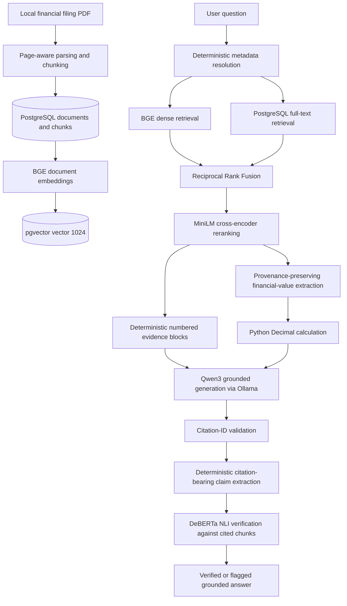

# AI Due Diligence Copilot

An evidence-first financial-document research system that combines local retrieval-augmented generation with deterministic financial calculations and semantic citation verification.

This project is deliberately more than “chat with a PDF.” It resolves filing metadata before retrieval, combines semantic and lexical evidence, reranks candidates, prevents the language model from performing authoritative arithmetic, validates every citation identifier, and independently checks whether cited evidence actually supports each generated claim.

The current checkpoint implements milestones M0–M7. Temporal comparison across separate filings begins in M8.

## Why this project is different

- **Evidence is scoped before retrieval.** Company, filing type, fiscal year, and document identity are resolved deterministically instead of guessed by the LLM.
- **Retrieval is hybrid.** Dense BGE retrieval and PostgreSQL full-text retrieval contribute candidates independently before Reciprocal Rank Fusion (RRF).
- **Relevance and factual support are separate questions.** A MiniLM cross-encoder reranks candidates; a distinct DeBERTa NLI model later checks whether cited evidence entails each generated claim.
- **Financial arithmetic is application logic.** Source values retain document, page, chunk, and citation provenance, while percentage changes use Python `Decimal` with explicit rounding.
- **Generation is local.** The default path uses Qwen3 through Ollama; financial documents and prompts need not be sent to a paid API.
- **Failure states are explicit.** Missing metadata, ambiguous documents, insufficient evidence, invalid citation IDs, unsupported claims, and verifier failures are surfaced rather than silently guessed away.

## Architecture through M7



## Technology stack

| Layer | Technology | Responsibility |
|---|---|---|
| API foundation | FastAPI, Pydantic Settings | Health endpoints and typed environment configuration |
| Persistence | PostgreSQL, SQLAlchemy, Alembic | Companies, filings, chunks, migrations, and provenance |
| Vector storage | pgvector | Exact cosine-distance search over 1024-dimensional vectors |
| PDF ingestion | pypdf | Page-aware text extraction |
| Embeddings | `BAAI/bge-large-en-v1.5` | Local 1024-dimensional document and instruction-prefixed query embeddings |
| Lexical retrieval | PostgreSQL full-text search | English `tsvector`/`websearch_to_tsquery` keyword candidates |
| Candidate fusion | Reciprocal Rank Fusion | Deterministic rank-based fusion without mixing incompatible score scales |
| Reranking | `cross-encoder/ms-marco-MiniLM-L6-v2` | Query–chunk relevance scoring after fusion |
| Generation | `qwen3:8b-q4_K_M` via Ollama | Structured answers grounded only in numbered evidence blocks |
| Financial reasoning | Python `Decimal` | Authoritative revenue-growth calculation and explicit rounding |
| Citation verification | `cross-encoder/nli-deberta-v3-small` | Local contradiction/entailment/neutral classification for cited claims |
| Tests | pytest, SQLite fixtures, fakes/stubs | Deterministic tests without model downloads or paid API calls |

## Local model responsibilities

Each model has one narrow role:

1. **BGE Large EN v1.5** embeds filing chunks and questions. Queries receive BGE’s retrieval instruction; documents do not. Embeddings are normalized and stored natively as 1024 dimensions—no padding or truncation.
2. **MiniLM MS MARCO cross-encoder** scores the relevance of fused retrieval candidates. Its score is used for ordering, not presented as factual confidence.
3. **Qwen3 8B Q4_K_M** writes a structured, evidence-grounded answer. It may explain deterministic tool output but may not replace or recompute authoritative financial arithmetic.
4. **DeBERTa v3 Small NLI** verifies each citation-bearing claim against the exact cited evidence. It is separate from both the retriever and generator.

The optional OpenAI embedding adapter remains behind the same `EmbeddingClient` boundary, but the default project path is fully local and requires no OpenAI credits.

## Data and provenance

The current schema is intentionally small:

```text
Company
└── Document (document type, fiscal year, source path)
    └── Chunk (document order, page, text, optional section, embedding)
```

The database enforces one document per company, document type, and fiscal year. Retrieval results preserve:

- company;
- document ID;
- document type;
- fiscal year;
- page number;
- chunk ID;
- vector, lexical, fusion, and reranking scores where applicable.

This provenance flows into numbered evidence blocks, generated citations, citation verification, and deterministic financial source values.

## Ingestion and embeddings

PDF ingestion is an offline CLI workflow:

```bash
python -m scripts.ingest_document \
  --company "Apple" \
  --document-type 10-K \
  --fiscal-year 2025 \
  --file data/apple_2025_10k.pdf
```

The parser extracts pages independently. Chunking remains page-bounded and uses fixed-size overlapping text windows, so human-readable page citations survive ingestion.

Populate only missing embeddings with:

```bash
python -m scripts.backfill_embeddings
```

The backfill targets `embedding IS NULL`, batches work, validates dimensions, and leaves already embedded chunks unchanged.

## Metadata-aware hybrid retrieval

Metadata resolution recognizes supported company names, document IDs, filing types, and fiscal years. It resolves them against the actual database catalog and removes complete metadata phrases—such as “in its 2025 10-K”—from the semantic query.

Requests are rejected when they:

- omit a resolvable company/document scope;
- conflict with explicit caller filters;
- match multiple documents;
- request unavailable metadata;
- contain multiple years outside the later temporal-comparison workflow;
- contain metadata but no meaningful search subject.

After resolution, both retrieval channels use exactly the same document scope:

1. pgvector returns exact cosine-nearest BGE candidates.
2. PostgreSQL full-text search returns lexical candidates.
3. RRF combines ranks using `1 / (k + rank)` per channel and deduplicates by chunk ID.
4. MiniLM reranks the fused candidate set and returns the final evidence.

There is no separate search service, BM25 daemon, or approximate vector index in this checkpoint.

## Deterministic financial reasoning

M4 implements a deliberately narrow revenue-growth tool:

```text
retrieved filing evidence
→ explicit total-net-sales values and units
→ source provenance validation
→ ((current - prior) / prior) × 100 using Decimal
→ ROUND_HALF_UP result
→ grounded Qwen interpretation
```

Missing values, conflicting values, mismatched units, invalid year ordering, negative values, and a zero denominator fail explicitly. Qwen receives the completed calculation as authoritative context and cannot override it.

## Grounded generation and citations

Retrieved chunks become stable evidence blocks `[1]`, `[2]`, and so on. The generator must return structured JSON containing:

- answer text with inline evidence markers;
- the unique citation IDs used;
- an `insufficient_evidence` flag.

Application validation rejects unknown IDs, duplicate IDs, disagreement between inline markers and the citation list, citations on insufficient-evidence responses, and supported answers without citations.

## Semantic citation verification

Citation-ID validation proves that a citation was supplied; it does not prove the citation supports the claim. M7 adds that second check:

1. Citation markers deterministically delimit citation-bearing claims.
2. Claim-focused source excerpts avoid truncating away relevant content at the verifier’s 512-token limit.
3. PDF-wrapped prose is reconstructed while table headers and matching rows remain intact.
4. Multi-citation claims are evaluated against the cited chunks jointly and in citation order.
5. DeBERTa returns three model softmax probabilities: contradiction, entailment, and neutral.

Verification states are intentionally conservative:

| State | Meaning |
|---|---|
| `supported` | Entailment has a strict majority probability (`> 0.5`) |
| `unsupported` | Contradiction has a strict majority probability (`> 0.5`) |
| `ambiguous` | Neither entailment nor contradiction has a strict majority |
| `error` | The verifier failed and the claim cannot be accepted |

An answer is `verified` only when every extracted claim is supported. Otherwise it is returned unchanged with explicit warnings; M7 does not silently rewrite, delete, or regenerate claims. Insufficient-evidence responses bypass NLI verification. Financial verification checks the cited source inputs but never recomputes or overrides the deterministic result.

## Prerequisites

The verified development environment used:

- macOS on Apple Silicon with 16 GB unified memory;
- Python 3.14.7;
- PostgreSQL 17;
- pgvector 0.8.6;
- Ollama with `qwen3:8b-q4_K_M`.

Python 3.11 or newer is recommended. Local model download sizes and memory requirements make at least 16 GB RAM/unified memory preferable for the complete pipeline.

## Local setup

### 1. Install system services

One macOS/Homebrew option is:

```bash
brew install postgresql@17 pgvector ollama
brew services start postgresql@17
ollama serve
```

If Ollama is already running as an application or service, do not start a second server.

Create a database and enable pgvector using a PostgreSQL role appropriate for your machine:

```bash
createdb dd_copilot
psql -d dd_copilot -c 'CREATE EXTENSION IF NOT EXISTS vector;'
```

### 2. Install Python dependencies

```bash
python3 -m venv .venv
source .venv/bin/activate
python -m pip install --upgrade pip
pip install -r requirements-dev.txt
```

### 3. Configure the environment

```bash
cp .env.example .env
```

Set `DATABASE_URL` in `.env` for your local PostgreSQL role and database. Keep `.env` local; it is ignored by Git.

### 4. Install the generator model

```bash
ollama pull qwen3:8b-q4_K_M
```

BGE, MiniLM, and DeBERTa are downloaded automatically by Sentence Transformers on first use. Model caches are local and excluded from version control.

### 5. Supply a filing

Source filing PDFs are intentionally not committed. Obtain the filing from the company’s investor-relations site or the official [SEC EDGAR company filings search](https://www.sec.gov/edgar/search/), verify the company, form, and period, then place it under `data/` or another local path.

For the verified Apple example:

```text
data/apple_2025_10k.pdf
```

The `data/` directory is retained with `.gitkeep`, while `data/*.pdf` remains ignored.

### 6. Initialize or migrate the database

This repository preserves the project’s incremental milestone history: M1/M2 created the base tables through SQLAlchemy metadata, and Alembic became authoritative for subsequent schema changes in M3. Consequently, the existing migrations are upgrades from an M2 database, not yet a clean-database baseline.

For an existing M2 database whose chunks do not yet have embeddings:

```bash
alembic upgrade head
```

For a brand-new local database at this checkpoint:

```bash
# Creates the current base tables while ingesting the first document.
python -m scripts.ingest_document \
  --company "Example Company" \
  --document-type 10-K \
  --fiscal-year 2025 \
  --file data/example_2025_10k.pdf

# The created schema already matches the embedding migrations.
alembic stamp 20260905_02
alembic upgrade head
```

Then generate missing embeddings:

```bash
python -m scripts.backfill_embeddings
```

Do not stamp an existing older schema blindly. Use `alembic current` first and apply its actual upgrade path.

## Running the API foundation

```bash
uvicorn app.main:app --reload
```

Available endpoints currently remain intentionally small:

- `GET /health` — application liveness;
- `GET /health/db` — PostgreSQL connectivity;
- `/docs` — generated OpenAPI documentation.

Retrieval, financial analysis, generation, and verification are modular application services rather than a public `/query` endpoint at this checkpoint.

## Tests

```bash
pytest -q
```

Current verified result: **99 passed**.

Unit tests use fake embedding, reranking, generation, and NLI providers. They do not download models, call OpenAI, require Ollama, or use paid APIs. Ingestion tests generate small PDF fixtures and use SQLite where appropriate. Real PostgreSQL and local-model smoke tests are run separately.

The verified local database contained:

- Apple 2025 10-K, document ID 1;
- 349 chunks;
- 349 BGE embeddings and zero NULL embeddings;
- 1024-dimensional vectors;
- Alembic revision `20260906_03`;
- pgvector 0.8.6.

These runtime records and the source PDF are not part of the repository.

## Representative verified behavior

- “What were Apple’s total net sales in 2025?” produced `$416,161 million` with evidence from page 39. DeBERTa classified the cited claim as supported.
- A two-source manufacturing and component-shortage claim was verified jointly against both cited page-11 chunks.
- A deliberately incorrect `$999 million` claim used a valid evidence ID but was classified as unsupported, demonstrating the difference between citation-ID validity and semantic support.
- A no-evidence response remained explicitly insufficient and skipped citation verification.
- Deterministic Apple total-net-sales growth from 2024 to 2025 remained `6.4%`; citation verification checked both source values without changing the calculation.

## Resource considerations on a 16 GB Mac

The full local stack is practical, but model lifecycle matters. Keeping BGE, MiniLM, Qwen, and DeBERTa resident simultaneously caused substantial memory contention during smoke testing.

A safer staged workflow is:

1. run BGE retrieval and MiniLM reranking;
2. release retrieval resources when practical;
3. generate with Qwen through Ollama;
4. unload Qwen if memory pressure matters (`ollama stop qwen3:8b-q4_K_M`);
5. run DeBERTa citation verification.

In the final staged smoke test, Qwen generation took approximately 60 seconds cold and 36 seconds warm. After a roughly 14-second CPU model load, individual NLI checks took approximately 0.2–0.4 seconds.

## Known limitations

- Only PDF ingestion and page-bounded fixed-size chunking are implemented; section labels are not extracted yet.
- Metadata parsing is deterministic and intentionally supports a limited filing vocabulary.
- Vector retrieval is exact; there is no HNSW or IVFFlat index.
- PostgreSQL full-text search is not a full BM25 implementation.
- RRF and reranker scores indicate retrieval ordering, not factual confidence.
- Revenue growth is the only deterministic financial tool currently implemented.
- Citation verification is probabilistic NLI, not formal proof. Long, highly compositional, or domain-subtle claims can remain ambiguous.
- Unsupported claims are flagged rather than automatically rewritten or regenerated.
- Model residency is not automatically orchestrated for low-memory machines.
- There is no public query API, frontend, authentication, Docker packaging, CI/CD, or generalized evaluation framework yet.
- The Alembic history begins as an upgrade from the original M2 schema; a clean baseline migration remains future repository-hardening work.
- Cross-filing temporal analysis requires separate filing documents. Comparative columns inside one filing are not treated as a substitute for another period’s actual filing.

## Milestones

| Milestone | Status | Scope |
|---|---:|---|
| M0 | Complete | Architecture and milestone boundaries |
| M1 | Complete | FastAPI, configuration, persistence foundation, health checks |
| M2 | Complete | Page-aware PDF ingestion and chunk storage |
| M3 | Complete | Local embeddings, pgvector retrieval, grounded Qwen generation, citation IDs |
| M4 | Complete | Deterministic revenue-growth calculation with provenance |
| M5 | Complete | Metadata-aware query planning and document resolution |
| M6 | Complete | PostgreSQL lexical retrieval, RRF fusion, MiniLM reranking |
| M7 | Complete | Claim extraction and DeBERTa semantic citation verification |
| M8 | Next | Temporal change detection across genuinely separate filings |

## Roadmap

M8 will begin with a narrow cross-filing comparison between separately ingested annual reports. It will align comparable evidence, preserve both periods’ provenance, compute numerical changes deterministically, ground interpretations in both filings, and reuse M7 verification.

Later milestones may add generalized risk analysis, management-claim verification, broader evaluation, product APIs/UI, authentication, caching, and deployment infrastructure. Those features are intentionally outside the current checkpoint.
