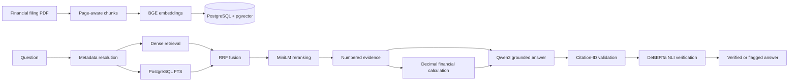

# AI Due Diligence Copilot

> **Evidence-grounded financial intelligence system that combines hybrid RAG, deterministic financial reasoning, and semantic citation verification over company filings.**

## What problem it solves

Financial filings are long, repetitive, and difficult to review under time pressure. A plausible answer is not enough for due diligence: reviewers need the underlying filing, page, source period, and confidence that the cited text actually supports the claim.

AI Due Diligence Copilot turns local company filings into searchable evidence, produces grounded answers, performs financial arithmetic in deterministic application code, and independently verifies generated citations.

## More than “chat with PDF”

- Filing metadata is resolved before retrieval instead of guessed by the LLM.
- Dense semantic search and PostgreSQL full-text search contribute independent candidates.
- Reciprocal Rank Fusion combines results without mixing incompatible score scales.
- A cross-encoder reranks evidence before it reaches the generator.
- Financial calculations use Python `Decimal`; the LLM may explain but cannot override them.
- Citation IDs are structurally validated, then a separate NLI model checks whether the cited evidence supports each claim.
- Unsupported, ambiguous, conflicting, and insufficient-evidence cases are explicit.

## Architecture



## Core capabilities

- **Grounded financial Q&A:** Qwen answers only from numbered filing evidence and returns structured inline citations.
- **Deterministic financial calculations:** revenue growth uses validated source values, explicit units, provenance, and `ROUND_HALF_UP` behavior.
- **Metadata-aware retrieval:** company, document ID, filing type, and fiscal year resolve against the actual document catalog. Ambiguous or unavailable scopes fail clearly.
- **Hybrid retrieval:** BGE cosine search and PostgreSQL lexical search run within the same document scope.
- **Fusion and reranking:** deterministic RRF deduplicates candidates before MiniLM cross-encoder scoring.
- **Citation verification:** citation-bearing claims are checked against their cited chunks, including joint evaluation of multi-citation claims. Results are `supported`, `unsupported`, `ambiguous`, or `error`.

## Local model stack

```text
BAAI/bge-large-en-v1.5                 → embeddings (1024 dimensions)
PostgreSQL + pgvector                  → vector storage and exact cosine search
PostgreSQL full-text search            → lexical retrieval
cross-encoder/ms-marco-MiniLM-L6-v2   → reranking
qwen3:8b-q4_K_M via Ollama             → grounded generation
cross-encoder/nli-deberta-v3-small    → semantic citation verification
```

Python, FastAPI, SQLAlchemy, Alembic, pypdf, Sentence Transformers, PyTorch, and pytest complete the stack. The default workflow is local and does not require paid API credits.

## Milestone status

| Milestone | Status | Result |
|---|---:|---|
| M0–M2 | Complete | Architecture, backend foundation, PDF ingestion |
| M3 | Complete | Local embeddings, pgvector retrieval, grounded generation |
| M4 | Complete | Deterministic revenue-growth tooling |
| M5 | Complete | Metadata-aware document resolution |
| M6 | Complete | Hybrid retrieval, RRF, cross-encoder reranking |
| M7 | Complete | Semantic citation verification |
| M8 | Next | Temporal change detection across separate filings |

Verified checkpoint: **99 tests passing**, Apple 2025 10-K ingested into 349 chunks, 349/349 BGE embeddings, pgvector `vector(1024)`, and Alembic revision `20260906_03`.

## Quick setup

Prerequisites: Python 3.11+, PostgreSQL with pgvector, and Ollama. A 16 GB Apple Silicon Mac was used for the verified local workflow.

```bash
python3 -m venv .venv
source .venv/bin/activate
pip install -r requirements-dev.txt

cp .env.example .env                 # configure DATABASE_URL
createdb dd_copilot
psql -d dd_copilot -c 'CREATE EXTENSION IF NOT EXISTS vector;'
ollama pull qwen3:8b-q4_K_M
```

Obtain an official filing from the company or [SEC EDGAR](https://www.sec.gov/edgar/search/) and place it in `data/`. PDFs are intentionally ignored by Git.

```bash
python -m scripts.ingest_document \
  --company "Apple" \
  --document-type 10-K \
  --fiscal-year 2025 \
  --file data/apple_2025_10k.pdf

# Fresh databases created by the current ingestion metadata:
alembic stamp 20260905_02
alembic upgrade head

python -m scripts.backfill_embeddings
pytest -q
uvicorn app.main:app --reload
```

For an existing pre-embedding M2 database, run `alembic upgrade head` directly instead of stamping. The API currently exposes health checks; retrieval, calculation, generation, and verification are modular application services rather than a public `/query` endpoint.

## Known limitations

- Chunking is page-aware but not yet section-aware.
- Revenue growth is the only deterministic financial tool.
- PostgreSQL FTS is not a full BM25 implementation; vector search is exact rather than ANN-indexed.
- NLI verification is probabilistic and may flag long or subtle claims as ambiguous.
- Unsupported claims are flagged, not automatically rewritten or regenerated.
- The Alembic history upgrades the original M2 schema and does not yet contain a clean baseline migration.
- Running every model simultaneously can create memory pressure on a 16 GB Mac. Retrieval, Qwen generation, and DeBERTa verification are safest as staged workloads.

## Roadmap

**M8: temporal change detection** will compare genuinely separate filing documents, align evidence across periods, compute numerical changes deterministically, explain meaningful disclosure changes, cite both periods, and reuse M7 citation verification.

Later milestones may add broader risk analysis, management claim-vs-evidence workflows, evaluation, product APIs/UI, authentication, and deployment infrastructure.
