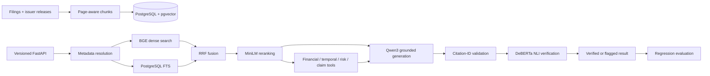

# AI Due Diligence Copilot

> **Evidence-grounded financial intelligence combining hybrid RAG, deterministic reasoning, management-claim checking, and semantic citation verification.**

## What it solves

Due diligence needs more than plausible answers. Reviewers need the correct filing, source pages, reporting periods, reproducible calculations, and evidence that citations actually support each claim. This local-first copilot makes company filings searchable, comparable, and independently verifiable without a mandatory paid AI API.

## Why it is more than “chat with PDF”

- Resolves company, filing type, and fiscal year before retrieval.
- Combines semantic and lexical search, then reranks the fused evidence.
- Keeps authoritative financial arithmetic in deterministic Python `Decimal` logic.
- Separates issuer claims from filing evidence and checks them without inferring intent.
- Validates citation IDs and uses a separate NLI model to test semantic support.
- Measures quality with a reviewed 42-case regression baseline.

## Architecture



## Core capabilities

- Grounded financial Q&A with numbered evidence and page-level provenance.
- Deterministic revenue comparison with validated inputs, explicit units, and rounding.
- Cross-filing temporal change detection and evidence-driven Risk Radar.
- Attributed Management Claim vs Evidence assessment.
- Metadata-aware BGE + PostgreSQL FTS retrieval, Reciprocal Rank Fusion, and MiniLM reranking.
- Structured Qwen output, insufficient-evidence behavior, and DeBERTa citation verification.
- Production API contracts, safe error envelopes, request IDs, JSON logs, readiness checks, bounded local inference, and model timeouts.

## Local stack

```text
BAAI/bge-large-en-v1.5                → 1024-dimensional embeddings
PostgreSQL + pgvector + FTS           → dense and lexical retrieval
cross-encoder/ms-marco-MiniLM-L6-v2  → reranking
qwen3:8b-q4_K_M via Ollama            → grounded generation
cross-encoder/nli-deberta-v3-small    → citation verification
FastAPI + SQLAlchemy + Alembic        → API, persistence, migrations
Docker Compose + GitHub Actions       → reproducible runtime and CI
```

## Status

M0–M11 are complete: architecture, ingestion, local RAG, deterministic finance, metadata routing, hybrid retrieval, citation verification, temporal comparison, Risk Radar, claim checking, and quantitative evaluation. **M12 adds the production API, container runtime, operational safeguards, and CI/CD foundation.**

Verified checkpoint: **222 tests passing**; two Apple 10-Ks plus the official FY2025 Q4 earnings-release exhibit; **639/639 chunks embedded**; pgvector `0.8.6`; Alembic `20260906_03`. The M11 baseline reports hybrid+rerank Recall@5 of **83.3%** and intentionally retains imperfect citation/refusal results as honest regression targets.

## Quick start

Prerequisites: Docker, Docker Compose, Ollama, and the pinned Qwen model. Model weights remain outside the image.

```bash
cp .env.example .env
# Set POSTGRES_PASSWORD and review DATABASE_URL/runtime settings.
ollama pull qwen3:8b-q4_K_M
docker compose build
docker compose run --rm migrate
docker compose up -d api
curl http://localhost:8000/health/ready
```

Interactive API documentation is available at `http://localhost:8000/docs`. The versioned surface provides grounded Q&A, revenue comparison, Risk Radar, and Management Claim vs Evidence endpoints. Detailed runtime guidance is in [`docs/operations.md`](docs/operations.md).

Place official filings or issuer releases from [SEC EDGAR](https://www.sec.gov/edgar/search/) in `data/`; PDFs are ignored by Git. For local development:

```bash
python3 -m venv .venv && source .venv/bin/activate
pip install -r requirements-dev.txt
alembic upgrade head
pytest -q
python -m evals.ci_gate
```

## Known limitations

- Revenue growth is the only authoritative financial calculation; temporal and risk categories are intentionally narrow.
- PostgreSQL FTS is not full BM25, vector search is exact, and chunking is page-aware rather than section-aware.
- The 42-case evaluation set is a regression signal, not a statistically representative benchmark.
- Cold local model startup is slow. A 16 GB Mac should use one worker and one in-flight AI request; retrieval, Qwen, and NLI run as staged workloads.
- No authentication, frontend, Redis queue, or managed deployment is included.

## Roadmap

M12 completes the portfolio productionization checkpoint. Future work may add authentication, asynchronous jobs, a reviewer UI, managed deployment, and broader financial tools without weakening the evidence and evaluation boundaries.
