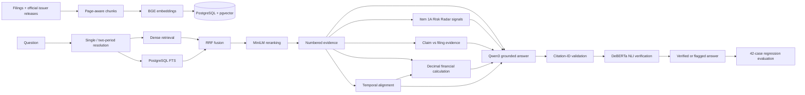

# AI Due Diligence Copilot

> **Evidence-grounded financial intelligence combining hybrid RAG, deterministic reasoning, management-claim checking, and semantic citation verification.**

## What problem it solves

Due diligence needs more than plausible answers: reviewers need source pages, reporting periods, deterministic calculations, and evidence that citations support their claims. This copilot makes local filings searchable, comparable, and independently verifiable.

## Architecture



## Core capabilities

- **Grounded financial Q&A:** Qwen answers only from numbered filing evidence and returns structured inline citations.
- **Deterministic financial calculations:** revenue growth uses validated source values, explicit units, provenance, and `ROUND_HALF_UP` behavior.
- **Temporal change detection:** filings are resolved by company, type, and year; changes retain evidence from both periods.
- **Risk Radar:** complete Item 1A scans organize four risk topics without severity scores and preserve two-period evidence.
- **Management Claim vs Evidence:** attributed issuer statements stay separate from filing facts, deterministic analysis, and Qwen interpretation.
- **Metadata-aware hybrid retrieval:** document scope is resolved before BGE and PostgreSQL FTS retrieval, RRF fusion, and MiniLM reranking.
- **Citation verification:** DeBERTa checks citation-bearing claims against cited chunks, including multi-citation evidence.
- **Quantitative evaluation:** a versioned golden set measures retrieval, generation, citations, domain logic, refusals, and latency independently, then compares future runs with an approved baseline.

## Local model stack

```text
BAAI/bge-large-en-v1.5                 → embeddings (1024 dimensions)
PostgreSQL + pgvector                  → vector storage and exact cosine search
PostgreSQL full-text search            → lexical retrieval
cross-encoder/ms-marco-MiniLM-L6-v2   → reranking
qwen3:8b-q4_K_M via Ollama             → grounded generation
cross-encoder/nli-deberta-v3-small    → semantic citation verification
```

FastAPI, SQLAlchemy, Alembic, pypdf, Sentence Transformers, PyTorch, and pytest complete a local workflow without paid APIs.

## Milestone status

| Milestone | Status | Result |
|---|---:|---|
| M0–M2 | Complete | Architecture, backend foundation, PDF ingestion |
| M3 | Complete | Local embeddings, pgvector retrieval, grounded generation |
| M4 | Complete | Deterministic revenue-growth tooling |
| M5 | Complete | Metadata-aware document resolution |
| M6 | Complete | Hybrid retrieval, RRF, cross-encoder reranking |
| M7 | Complete | Semantic citation verification |
| M8 | Complete | Cross-filing financial and disclosure comparison |
| M9 | Complete | Evidence-driven, temporally aware Risk Radar |
| M10 | Complete | Attributed management claims checked against filing evidence |
| M11 | Complete | Repeatable AI/RAG evaluation and regression baseline |

Verified checkpoint: **204 tests passing**, two Apple 10-Ks plus the official FY2025 Q4 earnings-release exhibit, 639/639 embedded chunks, pgvector `vector(1024)`, and Alembic revision `20260906_03`.

### Evaluation snapshot

The 42-case M11 baseline is intentionally small and inspectable. Hybrid+rerank Recall@5 is **83.3%**; deterministic financial, temporal, Risk Radar, and claim-state slices score **100%** on their reviewed cases. The baseline also exposes current weaknesses: DeBERTa supports **66.7%** of three generated factual claims, citation-contract validity is **80%**, and safe refusal behavior is **60%**. These are regression baselines, not claims of statistical certainty.

## Quick setup

Prerequisites: Python 3.11+, PostgreSQL with pgvector, and Ollama. The verified machine is a 16 GB Apple Silicon Mac.

```bash
python3 -m venv .venv
source .venv/bin/activate
pip install -r requirements-dev.txt

cp .env.example .env                 # configure DATABASE_URL
createdb dd_copilot
psql -d dd_copilot -c 'CREATE EXTENSION IF NOT EXISTS vector;'
ollama pull qwen3:8b-q4_K_M
```

Place official filings or issuer releases from [SEC EDGAR](https://www.sec.gov/edgar/search/) in `data/`; PDFs are ignored by Git.

```bash
python -m scripts.ingest_document \
  --company "Apple" \
  --document-type 10-K \
  --fiscal-year 2024 \
  --file data/apple_2024_10k.pdf

alembic stamp 20260905_02
alembic upgrade head

python -m scripts.backfill_embeddings
pytest -q
python -m evals.run --mode quick
python -m evals.run --mode full --output evals/reports/current.json
python -m evals.compare \
  --baseline evals/baselines/m11_v1.json \
  --current evals/reports/current.json
uvicorn app.main:app --reload
```

For a pre-embedding M2 database, run `alembic upgrade head` directly.

## Known limitations

- Chunking is page-aware, not section-aware; revenue growth is the only deterministic financial tool.
- Temporal finance covers consolidated total net sales; Risk Radar supports four Item 1A topics.
- Claim checking uses constrained, attributable earnings-release patterns; it is not a credibility score.
- NLI is conservative and may flag subtle or partly aligned wording as ambiguous.
- PostgreSQL FTS is not full BM25; vector search is exact rather than ANN-indexed.
- Running every model simultaneously can create memory pressure on a 16 GB Mac. Retrieval, Qwen generation, and DeBERTa verification are safest as staged workloads.
- The 42-case baseline is a regression signal, not a statistically representative benchmark; generation and refusal slices are especially small.

## Roadmap

**M12 next:** product APIs/UI, authentication, deployment, and CI/CD.
