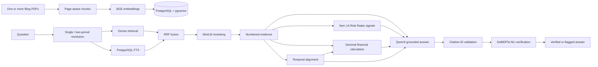

# AI Due Diligence Copilot

> **Evidence-grounded financial intelligence combining hybrid RAG, deterministic reasoning, temporal analysis, Risk Radar, and semantic citation verification.**

## What problem it solves

Due diligence needs more than plausible answers: reviewers need source pages, reporting periods, deterministic calculations, and evidence that citations support their claims. This copilot makes local filings searchable, comparable, and independently verifiable.

## More than “chat with PDF”

- Metadata is resolved before dense and lexical retrieval; RRF combines candidates before cross-encoder reranking.
- Financial calculations use Python `Decimal`; the LLM may explain but cannot override them.
- Temporal analysis and Risk Radar preserve evidence from both filings.
- Citation IDs are validated before a separate NLI model checks claim support.
- Unsupported, ambiguous, or insufficient cases are explicit.

## Architecture



## Core capabilities

- **Grounded financial Q&A:** Qwen answers only from numbered filing evidence and returns structured inline citations.
- **Deterministic financial calculations:** revenue growth uses validated source values, explicit units, provenance, and `ROUND_HALF_UP` behavior.
- **Temporal change detection:** distinct filings are resolved by company, type, and year. Apple FY2024–FY2025 net sales increased from $391.035B to $416.161B (**+$25.126B / +6.4%**), calculated deterministically.
- **Risk Radar:** complete Item 1A scans organize supply-chain, competition, cybersecurity, and legal/regulatory disclosures without severity scores. Apple supply-chain evidence was found in both periods and semantically `recurring_changed`; its page 12/page 11 summary passed M7 verification.
- **Metadata-aware retrieval:** company, filing type, and fiscal year resolve against the real catalog. Ambiguous or unavailable scopes fail clearly.
- **Hybrid retrieval:** BGE cosine search and PostgreSQL lexical search run within the same document scope.
- **Fusion and reranking:** deterministic RRF deduplicates candidates before MiniLM cross-encoder scoring.
- **Citation verification:** citation-bearing claims are checked against their cited chunks, including joint evaluation of multi-citation claims. Results are `supported`, `unsupported`, `ambiguous`, or `error`.

## Local model stack

```text
BAAI/bge-large-en-v1.5                 → embeddings (1024 dimensions)
PostgreSQL + pgvector                  → vector storage and exact cosine search
PostgreSQL full-text search            → lexical retrieval
cross-encoder/ms-marco-MiniLM-L6-v2   → reranking
qwen3:8b-q4_K_M via Ollama             → grounded generation
cross-encoder/nli-deberta-v3-small    → semantic citation verification
```

FastAPI, SQLAlchemy, Alembic, pypdf, Sentence Transformers, PyTorch, and pytest complete a local workflow without paid APIs.

## Milestone status

| Milestone | Status | Result |
|---|---:|---|
| M0–M2 | Complete | Architecture, backend foundation, PDF ingestion |
| M3 | Complete | Local embeddings, pgvector retrieval, grounded generation |
| M4 | Complete | Deterministic revenue-growth tooling |
| M5 | Complete | Metadata-aware document resolution |
| M6 | Complete | Hybrid retrieval, RRF, cross-encoder reranking |
| M7 | Complete | Semantic citation verification |
| M8 | Complete | Cross-filing financial and disclosure comparison |
| M9 | Complete | Evidence-driven, temporally aware Risk Radar |

Verified checkpoint: **152 tests passing**, two Apple 10-Ks (FY2024 and FY2025), 620/620 embedded chunks, pgvector `vector(1024)`, and Alembic revision `20260906_03`.

## Quick setup

Prerequisites: Python 3.11+, PostgreSQL with pgvector, and Ollama. The verified machine is a 16 GB Apple Silicon Mac.

```bash
python3 -m venv .venv
source .venv/bin/activate
pip install -r requirements-dev.txt

cp .env.example .env                 # configure DATABASE_URL
createdb dd_copilot
psql -d dd_copilot -c 'CREATE EXTENSION IF NOT EXISTS vector;'
ollama pull qwen3:8b-q4_K_M
```

Obtain official filings from the company or [SEC EDGAR](https://www.sec.gov/edgar/search/) and place them in `data/`. PDFs are intentionally ignored by Git; temporal analysis needs each period as a separately ingested document.

```bash
python -m scripts.ingest_document \
  --company "Apple" \
  --document-type 10-K \
  --fiscal-year 2024 \
  --file data/apple_2024_10k.pdf

# Fresh databases created by the current ingestion metadata:
alembic stamp 20260905_02
alembic upgrade head

python -m scripts.backfill_embeddings
pytest -q
uvicorn app.main:app --reload
```

For a pre-embedding M2 database, run `alembic upgrade head` directly. Repeat ingestion for each year, then backfill NULL embeddings. Analysis currently uses modular services rather than a public `/query` endpoint.

## Known limitations

- Chunking is page-aware but not yet section-aware.
- Revenue growth is the only deterministic financial tool.
- Temporal financial comparison is limited to consolidated total net sales; Risk Radar supports four explicit Item 1A topics, not a universal filing diff or risk ontology.
- Disclosure NLI is conservative: subtle or partly aligned wording is returned as ambiguous rather than promoted to a material business change.
- PostgreSQL FTS is not full BM25; vector search is exact rather than ANN-indexed.
- NLI may flag subtle claims as ambiguous; unsupported claims are not silently rewritten.
- The Alembic history upgrades the original M2 schema and does not yet contain a clean baseline migration.
- Running every model simultaneously can create memory pressure on a 16 GB Mac. Retrieval, Qwen generation, and DeBERTa verification are safest as staged workloads.

## Roadmap

**M10 and beyond:** management claim-vs-evidence workflows, evaluation, product APIs/UI, authentication, and deployment infrastructure.
